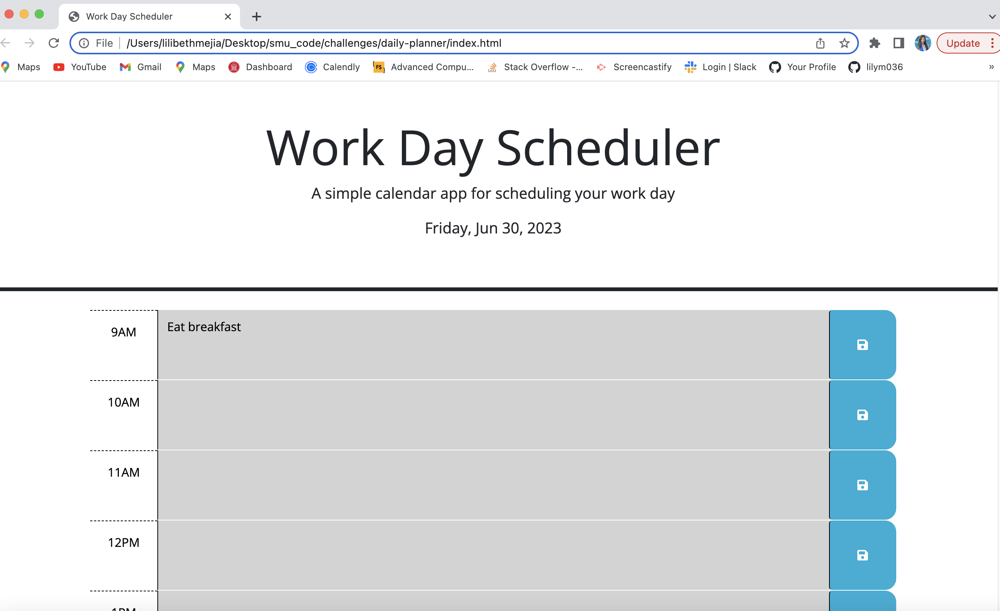

# daily-planner

## Description
This project was created to help employees keep track of important daily events in one place in order to manage their time more effectively. In addition, this calendar application allows a user to save events for each hour of a typical working day (9am–5pm). 

## Installation
N/A

## Usage
Open index.html file in the browser. There are three colors represeting the time. The block that is greyed out indicates a past time, a green block represents a future time, and a red block represents the current time. Input text into a block/section and save to store your information into the chosen time. 

;

## Credits
Sean Brown-Byfield- Tutor; Fred Kamm- TA

## License
MIT License

Copyright (c) 2023 Lilibeth Mejia

Permission is hereby granted, free of charge, to any person obtaining a copy
of this software and associated documentation files (the "Software"), to deal
in the Software without restriction, including without limitation the rights
to use, copy, modify, merge, publish, distribute, sublicense, and/or sell
copies of the Software, and to permit persons to whom the Software is
furnished to do so, subject to the following conditions:

The above copyright notice and this permission notice shall be included in all
copies or substantial portions of the Software.

THE SOFTWARE IS PROVIDED "AS IS", WITHOUT WARRANTY OF ANY KIND, EXPRESS OR
IMPLIED, INCLUDING BUT NOT LIMITED TO THE WARRANTIES OF MERCHANTABILITY,
FITNESS FOR A PARTICULAR PURPOSE AND NONINFRINGEMENT. IN NO EVENT SHALL THE
AUTHORS OR COPYRIGHT HOLDERS BE LIABLE FOR ANY CLAIM, DAMAGES OR OTHER
LIABILITY, WHETHER IN AN ACTION OF CONTRACT, TORT OR OTHERWISE, ARISING FROM,
OUT OF OR IN CONNECTION WITH THE SOFTWARE OR THE USE OR OTHER DEALINGS IN THE
SOFTWARE.

